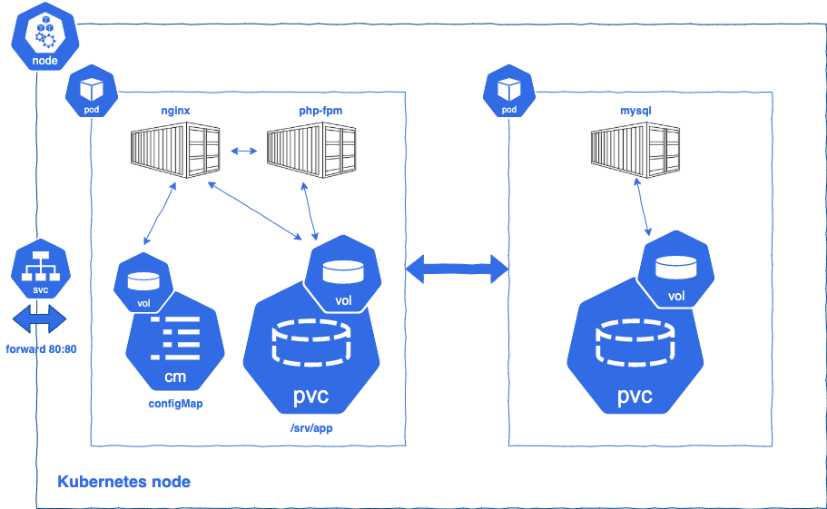

# Symfony As A Microservice (web app as a microservice)



This Repo made to explain how to integrate a web application in a microservice context.

[Kubernetes directory](https://github.com/sergioska/sylius-as-a-microservice/tree/master/kubernetes) can be used as a boilerplate in every web based project that works with nginx/php/mysql stack.

As it show above schema kubernetes node contains:

* a multi container pod for nginx and php-fpm
    * a persistent volume claim to host code
    * a volume for configMap (nginx configuration)
* a pod with a container for MySQL service
    * a persistent volume claim for mysql storage
* a service to expose throw forward web server port 80

## Run in Kubernetes (minikube)

To deploy application on your local kubernetes cluster you can execute follow bash script command inside kubernetes directory:

```
    bash start.sh
```

so copy source code from local to kubernetes node using kubectl cp

```bash
   # get web pod name
   kubectl get pods
   # copy source code in web pod
   kubectl cp . default/web-5d5c954d8c-76kmq:/srv/app
```

## Run with docker

Also you can run this project in your local docker environment running docker-compose from the root project:

```
    docker-compose up
```


